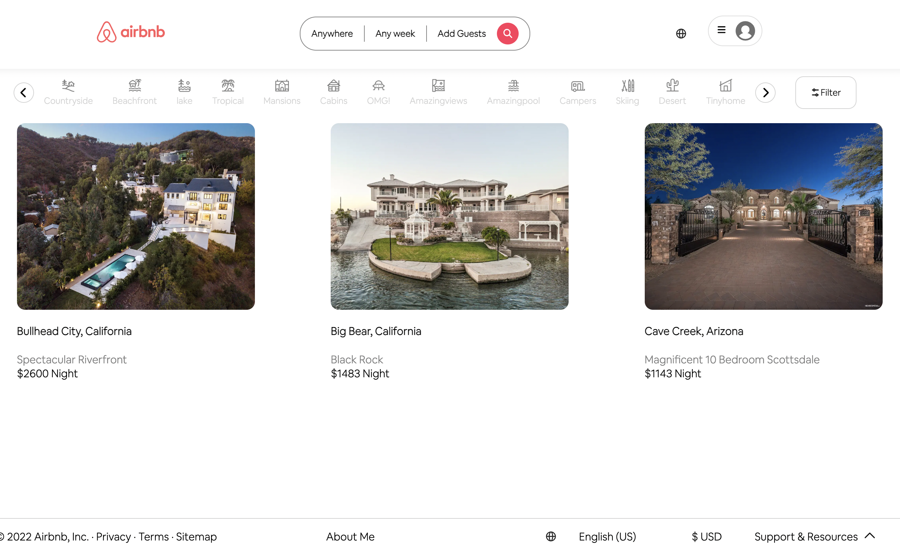
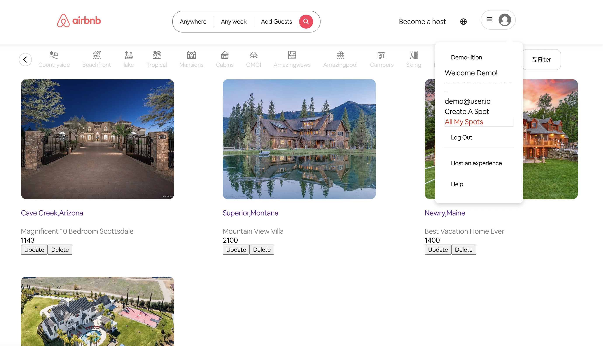

# AirBnb Clone

Welcome to my AirBnB Clone Project.

I have worked really hard in the last 2 weeks to make this pixel perfect. This project currently has two features, Spot (CFREATE, READ, UPDATE and DELETE) and Reviews (CREATE, READ,UPDATE,DELETE). 

I am currently working on a few more features to complete this project.

The tools that I used to make this clone are:

Back-End: NodeJS, Express, Sequelize,Sqlite3 AWS S3 Bucket for images.

Front-End: React, React-Redux, CSS, Font Awesome for icons. 

You can only delete and update your hosted place when you sign in!. In the All My Spots option.

